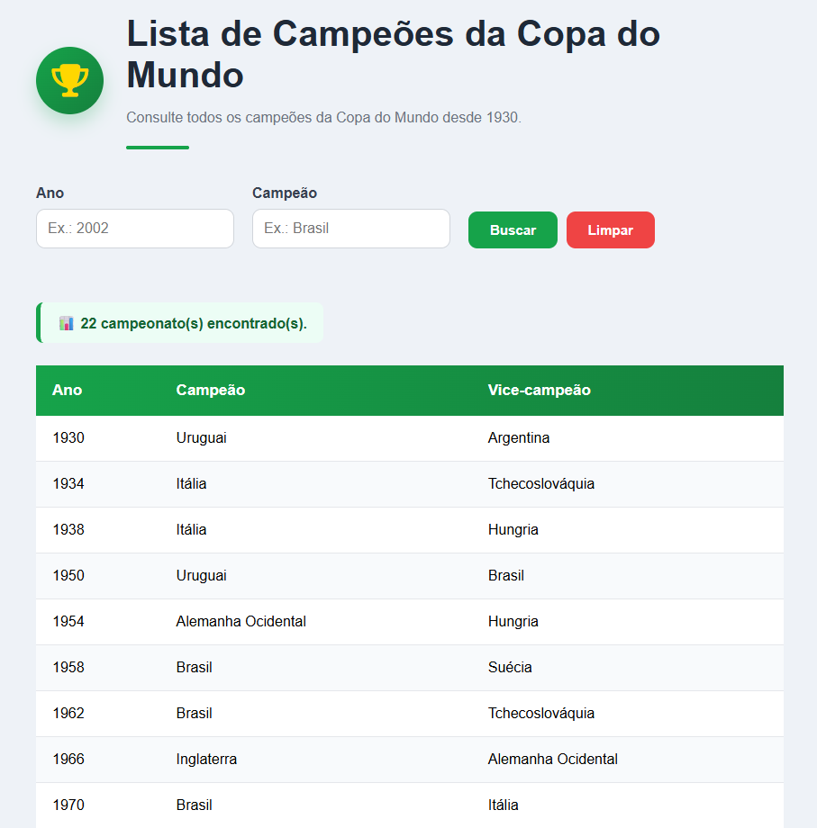

# 🏆 Campeões da Copa do Mundo

Aplicação Full Stack desenvolvida para consultar os campeões da Copa do Mundo FIFA utilizando uma API REST construída com Node.js, Express e MySQL.

---

## 📸 Demonstração

### 💻 Desktop



### 📱 Mobile


---

## ✨ Funcionalidades

- 📋 Listagem de todos os campeões da Copa do Mundo
- 🔎 Busca por ano
- 🌎 Busca por campeão
- 📊 Contador de resultados encontrados
- 📱 Layout responsivo
- ⚡ Consumo de API REST
- 🗄️ Integração com banco de dados MySQL

---

## 🚀 Tecnologias Utilizadas

### Front-end

- HTML5
- CSS3
- JavaScript

### Back-end

- Node.js
- Express
- MySQL

---

## 📂 Estrutura do Projeto

```text
copadomundo/

├── copadomundo-api/
│   ├── servico/
│   ├── index.js
│   ├── package.json
│   └── ...
│
├── copadomundo-front/
│   ├── assets/
│   ├── css/
│   ├── script.js
│   └── index.html
│
└── README.md
```

---

## ⚙️ Como executar o projeto

### 1️⃣ Clonar o repositório

```bash
git clone URL_DO_REPOSITORIO
```

### 2️⃣ Iniciar a API

```bash
cd copadomundo-api

npm install

npm start
```

Servidor disponível em:

```text
http://localhost:9000
```

### 3️⃣ Executar o Front-end

Abra o arquivo `index.html` utilizando o **Live Server**.

---

## 📌 Endpoints da API

### Listar todas as copas

```http
GET /copas
```

### Buscar por ano

```http
GET /copas?ano=2002
```

### Buscar por campeão

```http
GET /copas?time=Brasil
```

---

## 👨‍💻 Autor

**Maycon Douglas**

Desenvolvido como projeto de estudo para prática de desenvolvimento Full Stack utilizando HTML, CSS, JavaScript, Node.js, Express e MySQL.