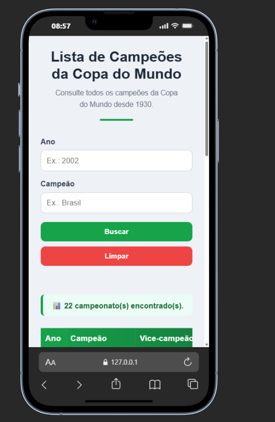

# 🏆 Lista de Campeões da Copa do Mundo

<p align="center">
  
</p>

<p align="center">


</p>

---

# 📖 Sobre o projeto

Aplicação Full Stack desenvolvida para consultar todos os campeões da Copa do Mundo FIFA desde 1930.

O projeto possui uma interface responsiva desenvolvida em HTML, CSS e JavaScript, consumindo uma API REST construída com Node.js e Express.

Os dados são armazenados em um banco PostgreSQL hospedado no Supabase e a aplicação está publicada utilizando Vercel (Frontend) e Render (Backend).

---

# 🚀 Demonstração

### 🌐 Front-end

https://campeoes-copa-do-mundo.vercel.app

### ⚡ API

https://campeoes-copa-do-mundo-api.onrender.com/copas

---

# 📸 Interface

## 💻 Desktop

<p align="center">

</p>

---

## 📱 Mobile

<p align="center">

</p>

---

# ✨ Funcionalidades

- ✅ Listagem completa dos campeões da Copa do Mundo
- ✅ Busca por ano
- ✅ Busca por campeão
- ✅ Contador de resultados encontrados
- ✅ Mensagem quando não houver resultados
- ✅ API REST
- ✅ Interface responsiva
- ✅ Banco PostgreSQL
- ✅ Deploy em produção

---

# 🛠 Tecnologias Utilizadas

## Front-end

- HTML5
- CSS3
- JavaScript (ES6)

## Back-end

- Node.js
- Express.js

## Banco de Dados

- PostgreSQL
- Supabase

## Deploy

- Vercel
- Render

---

# 📂 Estrutura do Projeto

```text
copadomundo
│
├── copadomundo-api
│   ├── servico
│   ├── index.js
│   ├── package.json
│   └── .env.example
│
├── copadomundo-front
│   ├── assets
│   │   └── images
│   │       ├── banner.png
│   │       ├── desktop.png
│   │       └── mobile.png
│   │
│   ├── css
│   ├── index.html
│   └── script.js
│
└── README.md
```

---

# 🔗 Endpoints

## Listar todas as Copas

```http
GET /copas
```

---

## Buscar por Ano

```http
GET /copas?ano=2002
```

---

## Buscar por Campeão

```http
GET /copas?time=Brasil
```

---

## Buscar por ID

```http
GET /copas/1
```

---

# ⚙ Como executar o projeto

## 1️⃣ Clone o repositório

```bash
git clone https://github.com/maycon-douglasd/campeoes-copa-do-mundo.git
```

---

## 2️⃣ Entre na pasta do projeto

```bash
cd campeoes-copa-do-mundo
```

---

## 3️⃣ Backend

```bash
cd copadomundo-api

npm install

npm start
```

O servidor será iniciado em:

```
http://localhost:9000
```

---

## 4️⃣ Frontend

Abra a pasta:

```
copadomundo-front
```

Depois execute utilizando a extensão **Live Server** do VS Code.

---

# 🗄 Banco de Dados

O projeto utiliza PostgreSQL hospedado no Supabase.

A conexão é realizada através da variável de ambiente:

```env
DATABASE_URL=sua_string_de_conexao
```

---

# 📚 Conceitos Praticados

Durante o desenvolvimento deste projeto foram aplicados conhecimentos em:

- HTML semântico
- CSS Responsivo
- Flexbox
- JavaScript ES6
- Fetch API
- Async / Await
- Node.js
- Express
- Middleware
- PostgreSQL
- Supabase
- Deploy de APIs
- Deploy Front-end
- Consumo de APIs REST
- Organização de projetos Full Stack
- Versionamento com Git
- GitHub

---

# 📈 Melhorias Futuras

- Login de usuários
- Histórico de pesquisas
- Estatísticas das seleções
- Filtro por continente
- Dark Mode
- Testes automatizados
- Docker
- CI/CD

---

# 👨‍💻 Autor

## Maycon Douglas Duarte de Sena

Desenvolvedor Front-end | JavaScript | Node.js

### GitHub

https://github.com/maycon-douglasd

### LinkedIn

https://www.linkedin.com/in/maycon-douglasds/

---

# ⭐ Gostou do projeto?

Se este projeto foi útil para você, deixe uma ⭐ no repositório.

Isso ajuda bastante a divulgar o projeto e incentiva novos desenvolvimentos.
